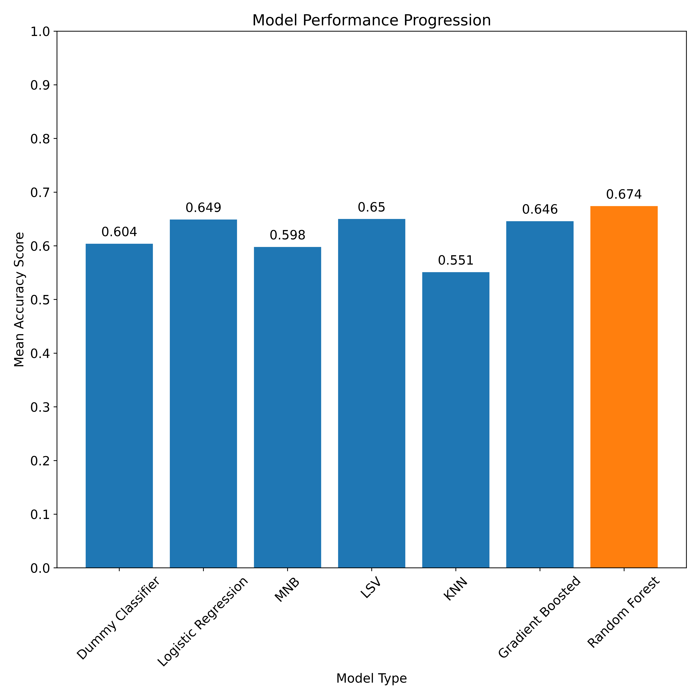

# Tweet Sentiment Classifier for BaceFook
Authors: Tom Chapman & John Sheehan

## Business Problem
We (Tall Guy Outreach, LLC) are customer satisfaction consultants retained by BaceFook to gauge the community'ss reception to new functionality they are adding to their app. While BaceFook has great relationships with their largest enterprise customers, their app is used by individuals across the world. They need a reliable way to understand how individuals and small companies are responding to the new functionality without directly contacting each one.

Our understanding is that the development team feels their new features could be controversial. While the features are aimed at making the app more appealing to enterprise customers, there was some concern during the development process that additional options might overwhelm existing users. The company closely monitors new installs of their app, so the impact of new features on new users is something they feel they have a good handle on. As a result, we will limit our review to community response as a whole.

Currently, BaceFook pays contract employees to review their twitter mentions, record the tweets and label them based on the sentiment expressed within. This is a significant source of cost and inefficiency, since it requires a large team to keep up with the volume of mentions that follow a new version release.

We will use natural language processing on a tweet dataset in order to train our model to recognize emotion expressed in the tweets. Once BaceFook's new functionality is released, we can feed new tweet information that mentions the app to our model and help the company understand how individuals are receiving the new functionality. With a strong enough classifier, the company should be able to reduce or eliminate its reliance on contract labor.

## Data Understanding
Our dataset includes 9,092 tweets about multiple brands and products. The tweets were labeled as positive, negative, neutral or not sure by contributors based on the sentiment that the user expressed about the product or products being discussed in the tweet. We elected to drop the 156 "not sure" tweets from our dataset since they accounted for less than 2% of the overall population. Most of the products being discussed are related to mobile devices and applications for those mobile devices, making the data well-suited for training a model on how users express sentiment for these types of products.

The data contains a significant class imbalance, with only 4.5% (411 tweets) classified as negative and only 33% (2,978 tweets) classified as positive. The remaining 62.5% (5,388 tweets) were neutral, which will require us to address class imbalance before running our models. In addition, the dataset is relatively small for a complex problem like sentiment analysis and may be unduly influenced by very active tweeters.

Natural language processing requires a significant level of preprocessing prior to modelling, due to the variety of features in a dataset. These efforts are visible in the final notebook, and included the following steps:
- Removing Twitter handles & hyperlinks
- Removing punctuation
- Tokenizing and Lemmatizing the words in each tweet
- Removing stopwords (both common English words and a custom set that is unique to our dataset)

After preprocessing was complete, we visualized the most common words in each sentiment class as follows:

## Modeling 
Our modelling efforts involved an iterative process through different classifiers to find the one that performed best with default hyperparameters. We evaluated our model performance using accuracy scoring because the cost of an incorrect prediction is relatively low, and we are interested in seeing how well a model predicts each of the individual classes. We then utilized a grid search to tune the hyperparameters of our best performing model in an attempt to further improve performance. The models are presented in order within the [completed notebook](bacefook_notebook.ipynb) from worst to best performing to demonstrate our iterative process. For the purposes of this summary, we will focus on the final random forest classifier model.

The following graph shows the accuracy score of each successive model, and highlights the superior performance of the random forest classifier.

## Results & Model Evaluation
With an accuracy score on the test data of 62%, our final model is performing better than the baseline on unseen data. There is a great deal of room for improvement however, as it struggles heavily with correctly identifying negative sentiment. The model only identified 21% of negative tweets correctly in our test data, and only 46% of positive tweets in the test data. Its superior accuracy score is due largely to its success in accurately classifying neutral tweets as neutral. With more than 60% of the dataset comprised of neutral tweets, the success in predicting that class outweighs its poor performance with tweets that express emotion.

Given the class imbalance present in the dataset, it is likely that the model doesn't have enough examples of negative sentiment to perform well. This could be improved with a larger (or at minimum, more balanced) dataset. In order to be useful for classifying new tweets, the model would need to significantly reduce or ideally eliminate the need for a human to manually check its work. Our model accomplishes that with a 62% accurate rate, but still leaves quite a bit of room for error and therefore creates a requirement for manual follow-up. Further tuning of the model's hyperparameters are unlikely to produce significant improvement, meaning that more data (and specifically more negative data) is needed to improve the model's results.

If no further data can be reasonably obtained for training, a practical use of the model could be to separate future tweets into groups of "neutral" and "needing review". The "needing review" class could then be labeled by a human or fed to a binary classifier that might have success identifying them as positive or negative.

## Conclusion
Our model correctly classified tweet sentiment 62% of the time on unseen data. The other 38% of the time, it misclassified a positive, negative or neutral tweet as one of the other sentiments. It struggled the most with negative sentiment, which makes sense given the class imbalance present in the data. With relatively few examples of negative language, it is hard for the model to pick up on what makes a negative tweet negative. A first step in improving the model's performance could be to provide additional examples of negative sentiment tweets for further training of the model.

### Recommendations & Next Steps
* __Persistent Training__ 
The dataset we trained on is relatively small for an nlp project, and could be improved by continual training and improvement of the model. Given that tweets are so easy to compose, it should be possible to get new data points nearly every day. Twitter's api makes these accessible and the preprocessing can be performed with relative ease using the code herein. One might also argue that because tweets are so easy to write, you are more likely to capture a person's thoughts when they are feeling emotional about something. It's much easier to post a tweet in the heat of the moment than to sit down and write a longer blog post or essay to tease out one's emotions. That can be a double-edged sword however, because of Twitter's character limit. With a small number of characters, not everyone can easily convey nuanced emotion. If simple words are duplicated across all sentiment classes, they start to lose their meaning to the model.

* __Source New Data from Additional Social Media Applications__
The company's own BaceFook posts are a logical place to start, but reddit is another example that might prove fruitful due to its ability to accommodate longer posts. With a greater variety of language in each sentiment class, the model will be better able to differentiate between positive, negative and neutral emotion.

* __Investigate More Advanced Models__
If the company is willing to spend up for distributed computing, we would recommend applying a neural network model to the task. There are many pre-trained sentiment analysis algorithms that we could tune using our dataset that might produce superior results. The downside of course is paying for the implementation in a cloud platform. Still, BaceFook might see benefit if model performance can be improved to the point that it eliminates the need for a human to spot-check its work.

## For More Information

See the full analysis in the [Jupyter Notebook](bacefook_notebook.ipynb) or review [this presentation](final_bacefook_presentation.pdf).

For additional info, contact John Sheehan or Tom Chapman as follows:

- John:  johnjsheehan8@gmail.com  
- Tom:   thomas.h.chapman@gmail.com
 
## Repository Contents
- data
- images
- working notebooks
- .gitignore
- README.md
- bacefook_notebook.ipynb
- final_bacefook_presentation.pdf